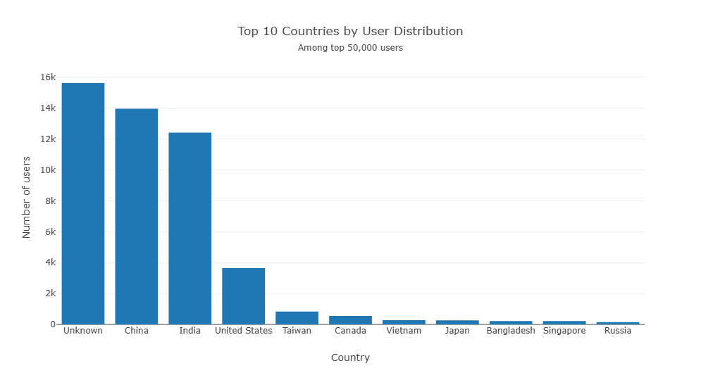
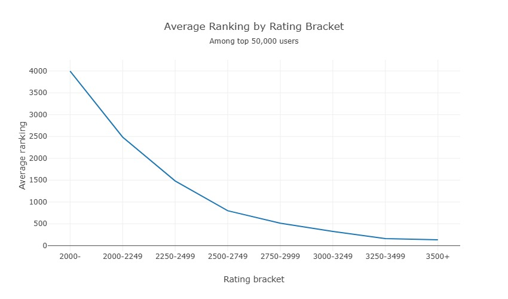
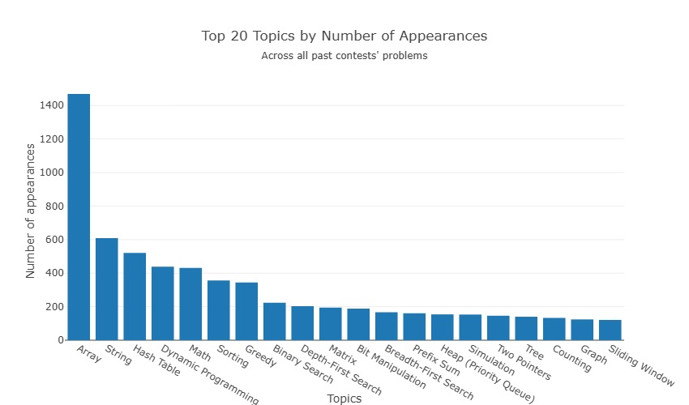

# LeetCode Contest Analytics
The following observations are conducted with **_Amazon Redshift_**.

## Data Overview
- The collected data are from the top **50,000** users of _LeetCode_ global contest ranking and **2334** problems 
of **585** contests.
- The range of ratings in the data collected is **1788 - 3700**.

## Duplicated Users
- There are roughly **60** users that appear more than once in the collected data, not including _NULL_ or deleted users.
- Their accounts exist in both US and CN data regions.

## Countries by Number of Users

- Approximately **15,600** users are from unknown countries.
- China and India are the two largest populations in the world. The markets in these countries are probably more 
competitive as well.
- These top countries are likely more competitive and developed in the tech market.

## Average Ranking by Rating Bracket

- _Average ranking_ is the average placement of all contests a user attended.
- Overall, the average ranking distribution is pretty diverse, except for the top contestants.
- The lower the rating, the more diverse the average ranking.
- It can be inferred from the data that users with higher ratings usually perform more consistently across contests.
- Contestants can predict their future growth and potential rating bracket based on this graph. Eg: A person with a
current rating of 2000 and an average ranking of 100 can possibly reach 3250+ without difficulty.

## Topics by Number of Appearances

- These topic tags show up most frequently during contests.
- The topic tags in _LeetCode_ might be insufficient. Eg: A problem uses the line sweep technique, but it's not tagged line sweep.
- Practicing these topics accordingly might improve your average contest placement.